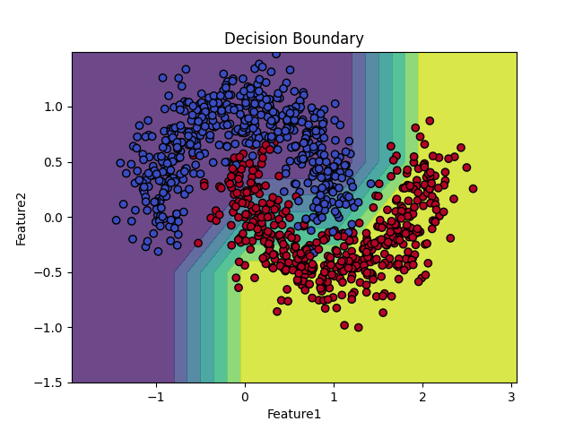
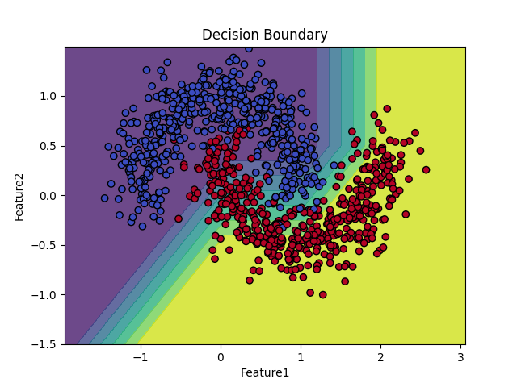
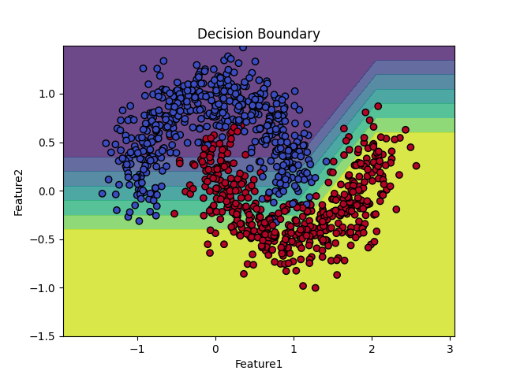

# Comparison Table of SVC, NuSVC, and LinearSVC Models

| Model               | Kernel                      | Key Parameters      | Accuracy            | Decision Boundary                                | Remarks                                                                                                                                 |
| ------------------- | --------------------------- | ------------------- | ------------------- | ------------------------------------------------ | --------------------------------------------------------------------------------------------------------------------------------------- |
| **SCV**       | RBF (Radial Basis Function) | C=1.0, gamma=auto   | ~0.9766666666666667 | Non-linear, smooth and fits non-linear data well | SVC with RBF kernel is suitable for non-linear classification like the moon dataset, yielding good results.                             |
| **NuSVC**     | RBF                         | nu=0.5, gamma=auto | ~0.91               | Non-linear, similar to SVC                       | NuSVC controls the margin through the `nu` parameter, achieving results similar to SVC with RBF.                                      |
| **LinearSVC** | Linear                      | C=1.0               | ~0.8766666666666667 | Linear, a straight line                          | LinearSVC is suitable for linear data but performs worse on the moon dataset due to its non-linear nature, resulting in lower accuracy. |

### Simulation Results:

1. SVC (Support Vector Classifier): **Accuracy:** Approximately 0.9766666666666667

   
2. NuSVC (Nu Support Vector Classifier): **Accuracy:** Approximately 0.91

   
3. LinearSVC (Linear Support Vector Classifier): **Accuracy:** Approximately 0.8766666666666667

   

### Results and Observations:

* **Accuracy:** SVC with RBF kernel and NuSVC show higher accuracy compared to LinearSVC because of their ability to handle non-linear data. Although LinearSVC is faster and less complex, it is not suitable for non-linear shaped data like the moon dataset.
* **Decision Boundary:**

  * SVC and NuSVC with RBF kernel create curved boundaries that adapt to the data shape, offering better classification.
  * LinearSVC only produces a straight line, making it less effective when the data has complex non-linear patterns.

### Reason for Model Selection:

* **SVC with RBF Kernel** is selected as the most suitable model for the moon dataset due to its excellent non-linear classification capabilities and highest accuracy among the tested models. SVC effectively demonstrates its advantage when data cannot be separated linearly, which aligns well with the problem requirements.
